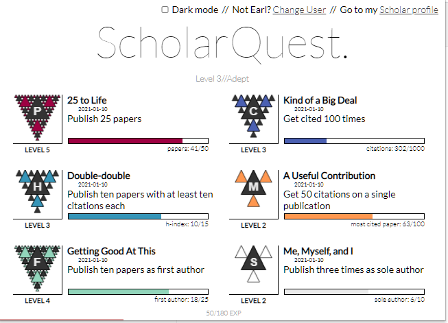

# ScholarQuest
Academia gamified! Gain experience, unlock achievements, and level up when you contribute to humanity's quest for knowledge by publishing scholarly articles. 

It's a chrome extension that tracks the data on your Google Scholar profile page and gives achievements when you reach certain milestones. 

Example:

     

